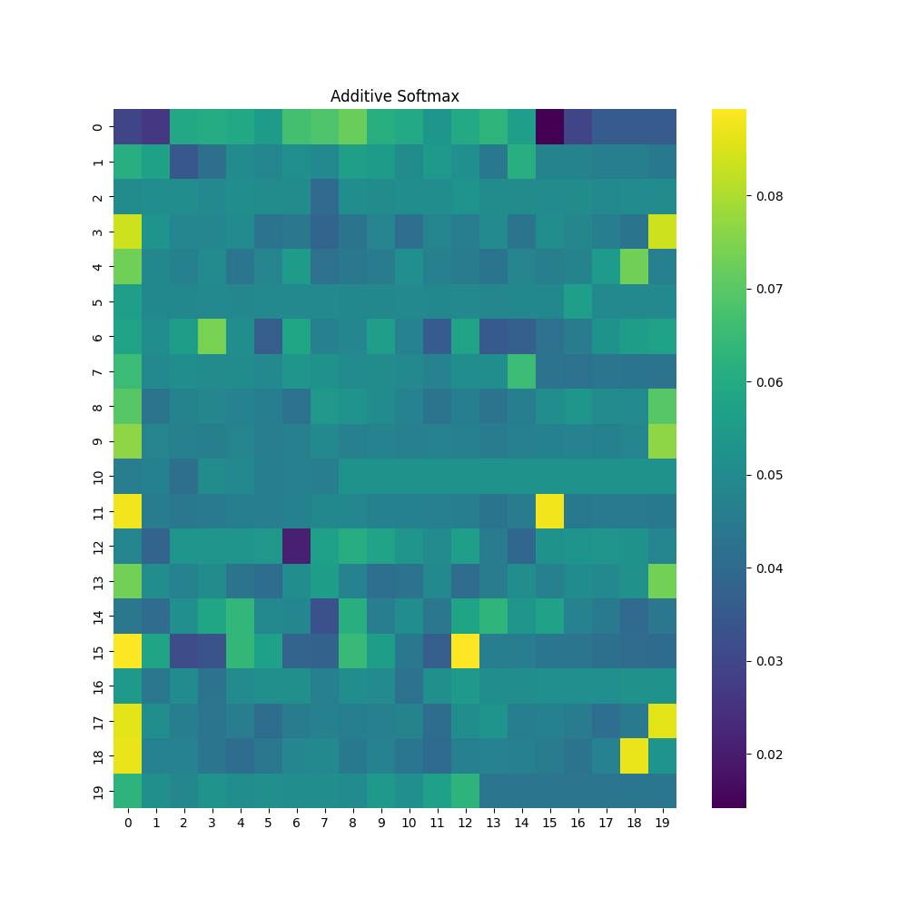
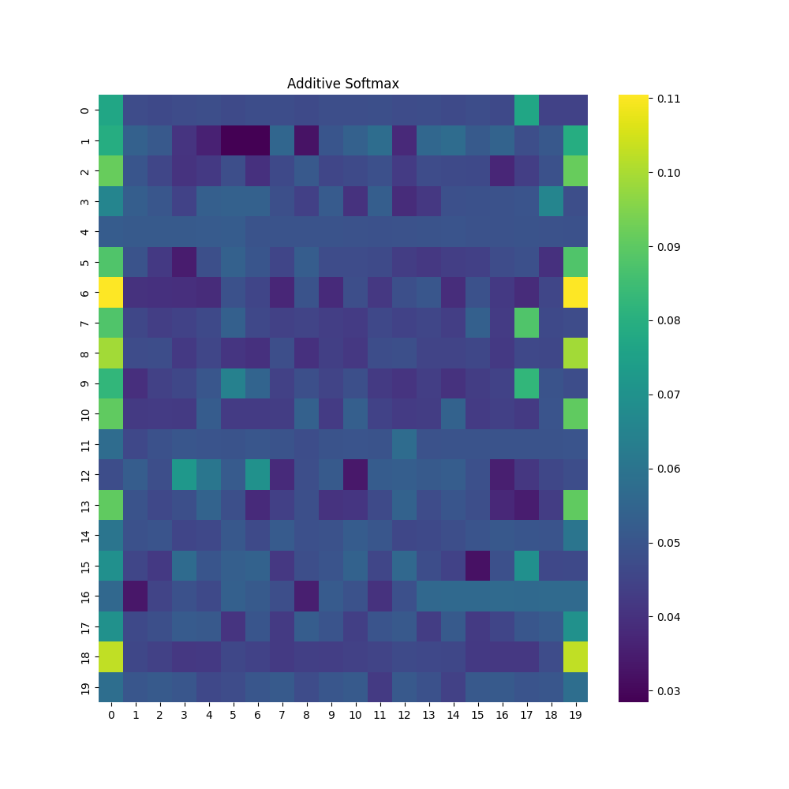
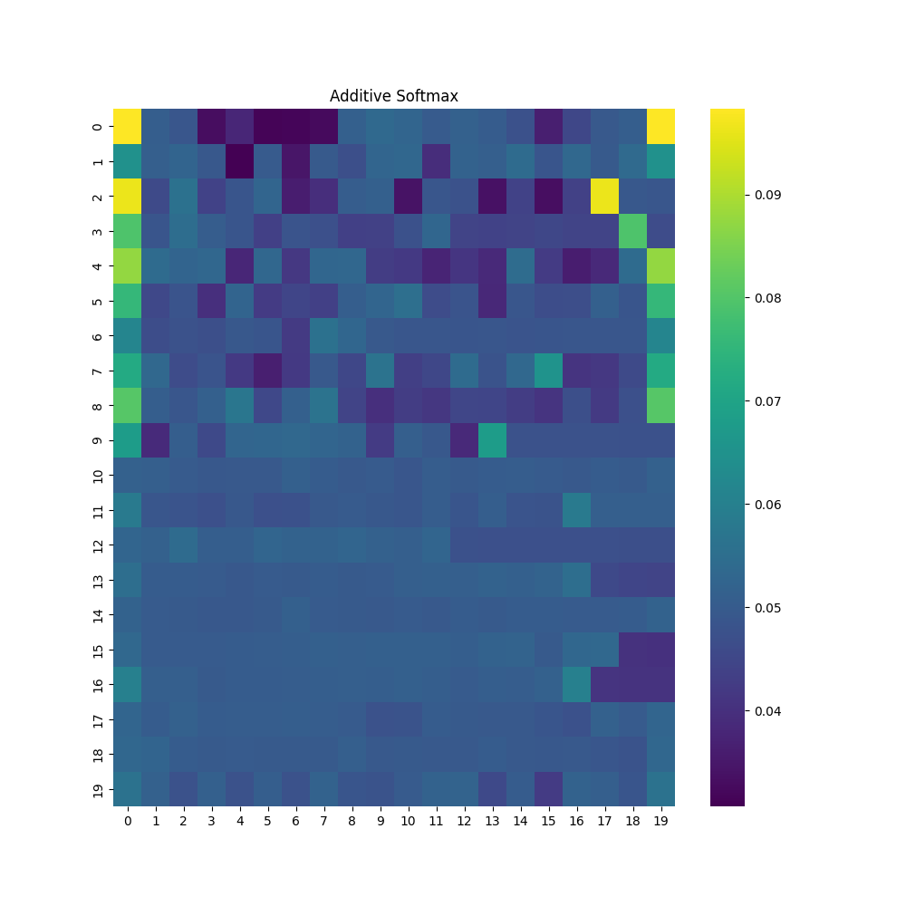
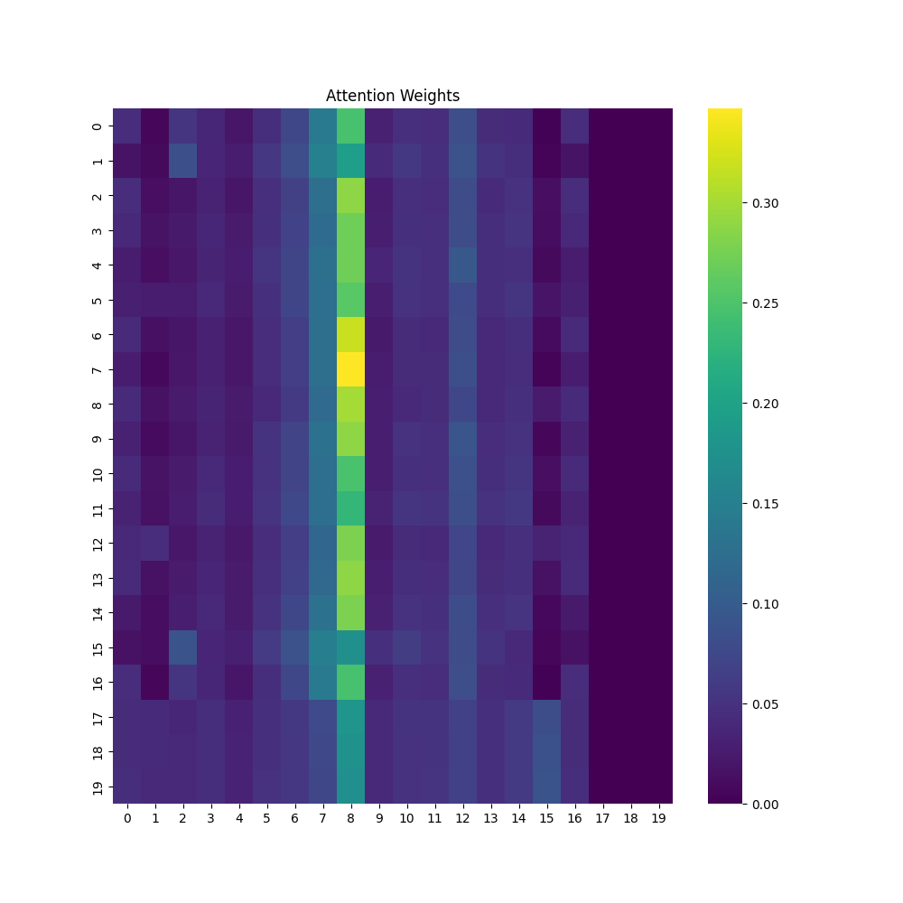
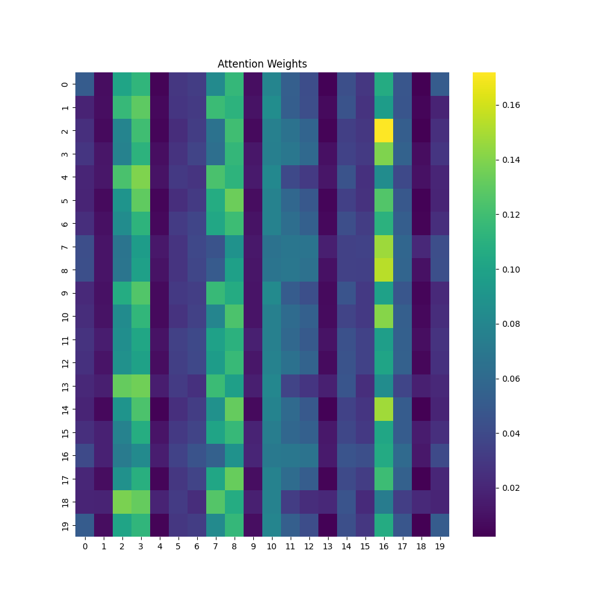
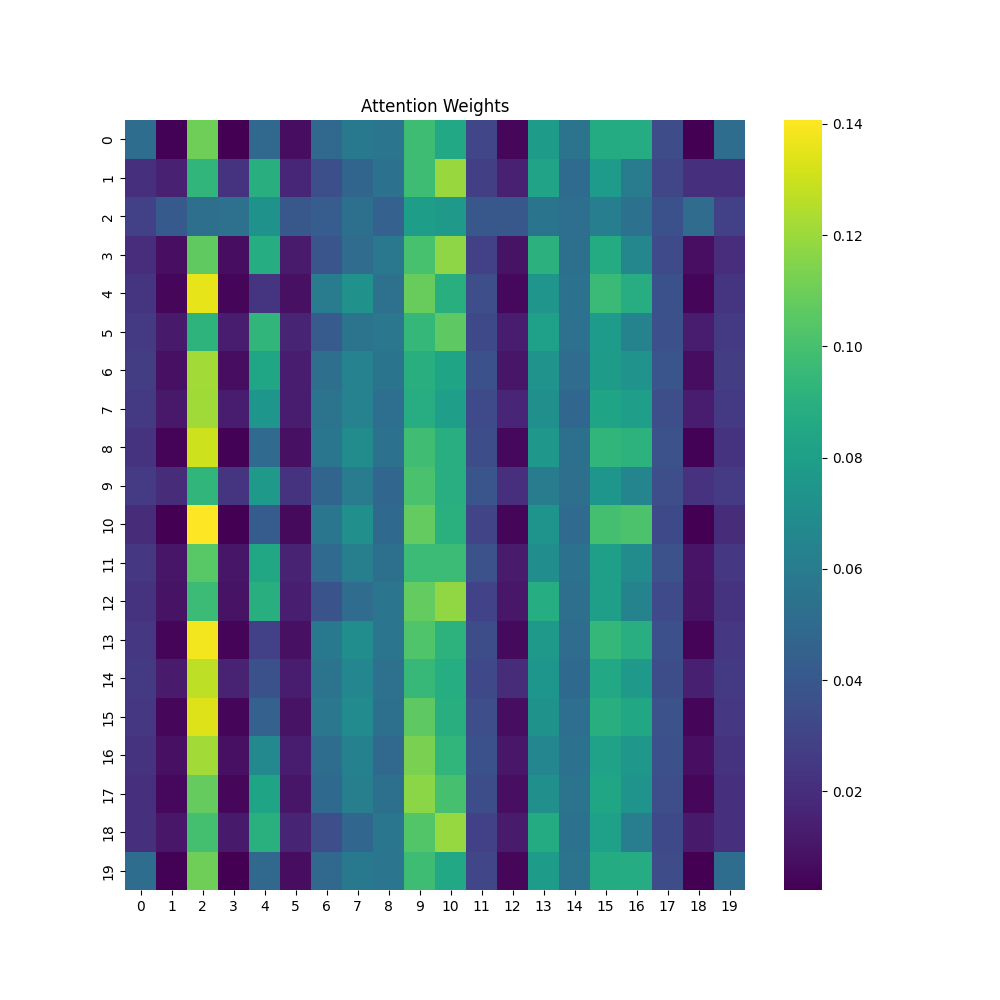
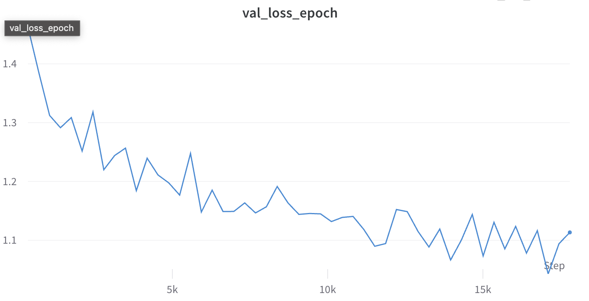

# Installation

## 1. Poetry
```zsh
poetry install
```

## 2. Pip
```zsh
pip install -r requirements.txt
```

# Train Results

## Additive Attention

<p float="left">
  
   
  
</p>

## Attention

<p float="left">
  
   
  
</p>

## Validation Loss

- 이 그림은 4개의 네거티브와 1개의 포지티브 중 하나를 선택하는 소프트맥스를 나타냅니다. 
- 소프트맥스의 결과 Candidate 는 약 35~38%의 확률을 나타냅니다.




# NRMS Approach for News Recommendation

## 1. **News Encoder**

The purpose of the News Encoder is to learn news representations from news titles. It contains three layers:

- **Word Embedding Layer**: Converts a news title from a sequence of words into low-dimensional embedding vectors.
  
```markdown
[w1, w2, ..., wM] -> [e1, e2, ..., eM]
```

- **Word-level Multi-head Self-attention Layer**: Captures interactions between words which are important for learning news representations. This layer is advantageous as it can capture long-distance interactions between words in a news title.
  
```markdown
α_k_i,j = exp(e_i^T Qw_k e_j) / sum(exp(e_i^T Qw_k e_m))
h_w_i,k = Vw_k * sum(α_k_i,j * e_j)
```

- **Additive Word Attention Network**: Selects important words in news titles to create more informative news representations.
  
```markdown
a_w_i = q_w^T tanh(Vw * h_w_i + vw)
α_w_i = exp(a_w_i) / sum(exp(a_w_j))
r = sum(α_w_i * h_w_i)
```

## 2. **User Encoder**

The User Encoder module learns representations of users based on the news they've browsed. It consists of two layers:

- **News-level Multi-head Self-attention Network**: Enhances news representations by capturing interactions between the news articles browsed by the user.
  
```markdown
β_k_i,j = exp(r_i^T Qn_k r_j) / sum(exp(r_i^T Qn_k r_m))
h_n_i,k = Vn_k * sum(β_k_i,j * r_j)
```

- **Additive News Attention Network**: Selects important news to better represent users based on their browsing history.
  
```markdown
a_n_i = q_n^T tanh(Vn * h_n_i + vn)
α_n_i = exp(a_n_i) / sum(exp(a_n_j))
u = sum(α_n_i * h_n_i)
```

## 3. **Click Predictor**

Predicts the probability of a user clicking on a candidate news using the dot product of user representation and news representation vectors.

```markdown
yˆ = u^T r_c
```

## 4. **Model Training**

For training, negative sampling techniques are used. The approach randomly samples K news articles that are shown but not clicked by a user. The model's loss function is based on the negative log-likelihood of all positive samples.

```markdown
pi = exp(yˆ_+i) / (exp(yˆ_+i) + sum(exp(yˆ_-i,j)))
L = -sum(log(pi))
```

# Unresolved Troubleshooting
## 1. dataset 병목 제거 필요..
## 2. 
